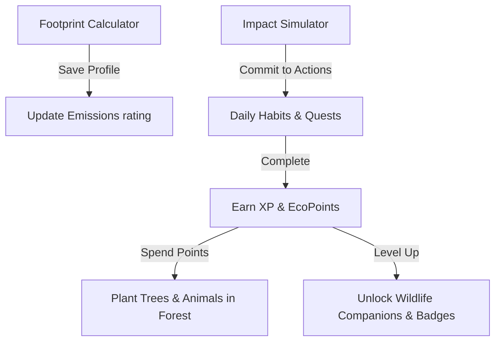

# 🌿 EcoSphere — Carbon Footprint Tracker & Gamified Ecosystem

> **Track, Reduce, and Gamify Your Carbon Footprint.** Make a real impact, one eco-habit at a time.

EcoSphere is a client-side progressive web application (PWA) designed to track individual carbon emissions, simulate habit improvements, complete real-world ecological quests, and nurture a dynamic **Virtual Forest** using gamified mechanics. Built entirely using vanilla web technologies, the app is optimized for high visual performance, responsiveness, and offline access.

---

## 🚀 Live Demo & Project Links
* **Vercel Deployment**: [challange-1-psi.vercel.app](https://challange-1-psi.vercel.app)
* **GitHub Repository**: [github.com/hetvisavaj/Challange-1](https://github.com/hetvisavaj/Challange-1) (Renaming to `Ecosphere` soon!)

---

## 📂 Project Directory Structure

- 📄 [index.html](file:///c:/Users/dmsav/.gemini/antigravity-ide/scratch/carbon-footprint-tracker/index.html) — Core markup, structural views, dialog screens, and SVG defs.
- 📄 [style.css](file:///c:/Users/dmsav/.gemini/antigravity-ide/scratch/carbon-footprint-tracker/style.css) — Custom variables, glassmorphism card layouts, mobile sliding drawer queries, and keyframe animations.
- 📄 [app.js](file:///c:/Users/dmsav/.gemini/antigravity-ide/scratch/carbon-footprint-tracker/app.js) — Main logic containing state management, emission formulas, SVG foliage generation, and route handlers.
- 📄 [sw.js](file:///c:/Users/dmsav/.gemini/antigravity-ide/scratch/carbon-footprint-tracker/sw.js) — Service Worker enabling offline PWA functionality.
- 📄 [package.json](file:///c:/Users/dmsav/.gemini/antigravity-ide/scratch/carbon-footprint-tracker/package.json) — Local test dependencies (Jest, JSDOM).

---

## 🧮 Carbon Emission Formulas

All calculations in EcoSphere are performed instantly on the client side using established carbon equivalents. Footprint results are represented in **Metric Tons of CO₂e per year**.

### 1. Transportation
Emissions are calculated as the sum of three travel vectors:
$$\text{Emissions}_{\text{transport}} = \text{Emissions}_{\text{driving}} + \text{Emissions}_{\text{public transit}} + \text{Emissions}_{\text{flights}}$$

- **Driving**: 
  $$\text{Emissions}_{\text{driving}} = \frac{\text{Weekly Miles} \times \text{Vehicle Coefficient} \times 52}{1000}$$
  * *Petrol/SUV Coefficient*: `0.404` kg CO₂e/mile
  * *Hybrid Coefficient*: `0.210` kg CO₂e/mile
  * *Electric Coefficient*: `0.080` kg CO₂e/mile (based on average grid mix)
- **Public Transit**:
  $$\text{Emissions}_{\text{transit}} = \frac{\text{Weekly Hours} \times 15\text{ mph} \times 0.150\text{ kg/mile} \times 52}{1000}$$
- **Flights**:
  $$\text{Emissions}_{\text{flights}} = \frac{\text{Annual Flights} \times 280\text{ kg}}{1000}$$

### 2. Home Energy
Emissions combine household electricity and primary heating source offset by renewable options:
$$\text{Emissions}_{\text{energy}} = \text{Emissions}_{\text{electricity}} \times \left(1 - \frac{\text{Renewable Share \%}}{100}\right) + \text{Emissions}_{\text{heating}}$$

- **Electricity**:
  $$\text{Emissions}_{\text{electricity}} = \frac{\text{Monthly Bill (\$)} \times 8\text{ kWh/\$} \times 0.35\text{ kg CO₂e/kWh} \times 12}{1000}$$
- **Heating Source**:
  * *Natural Gas*: `1.2` tons CO₂e/year
  * *Electric Heat Pump*: `0.6` tons CO₂e/year
  * *Heating Oil / Coal*: `2.4` tons CO₂e/year

### 3. Diet & Nutrition
Flat annual rates based on carbon intensity of agricultural practices:
- **Frequent Meat Eater**: `2.5` tons CO₂e/year
- **Low Meat / Flexitarian**: `1.5` tons CO₂e/year
- **Vegetarian**: `0.9` tons CO₂e/year
- **Vegan**: `0.5` tons CO₂e/year

### 4. Waste & Consumption
$$\text{Emissions}_{\text{waste}} = \text{Emissions}_{\text{recycling}} + \text{Emissions}_{\text{shopping}}$$

- **Recycling Habits**:
  * *Do not recycle*: `0.8` tons CO₂e/year
  * *Basic Recycling*: `0.4` tons CO₂e/year
  * *Full Compost & Recycling*: `0.1` tons CO₂e/year
- **Shopping Habits**:
  * *Minimalist*: `0.3` tons CO₂e/year
  * *Average Consumer*: `0.7` tons CO₂e/year
  * *Frequent Shopper*: `1.5` tons CO₂e/year

---

## 🌿 The Gamified Ecosystem

EcoSphere makes lifestyle adjustments rewarding through interconnected systems:



- **Interactive Virtual Forest**: Re-renders dynamically via [app.js](file:///c:/Users/dmsav/.gemini/antigravity-ide/scratch/carbon-footprint-tracker/app.js) using customized SVG overlays. Conifers, Oaks, wildflower shrubs, and roaming animals sway with animations and get watered in real-time.
- **Eco-Shop**: Buy specialized species like Baobabs or Jacarandas, or secure authenticated Amazon offset certificates.
- **Daily Trivia Quiz**: Earn +100 XP and +150 EcoPoints by testing environmental awareness.

---

## 📲 Architecture & Design Systems

### 1. State Management & Schema Validation
All state parameters are serialized in LocalStorage per user profile. The application implements strict JSON schema validation during startup to prevent data corruption:
- Verifies range types (e.g. `electricityBill >= 0`, `renewableShare 0-100`).
- Upgrades legacy storage configurations seamlessly with default fallbacks when new features are added.

### 2. Responsive UI Design System
Built with vanilla CSS variable custom tokens (`--primary`, `--card-bg`, `--glass-blur`):
- **Desktop Grid**: Features side-by-side modular layouts with floating dashboards, trend line charts, and donut breakdowns.
- **Mobile sliding drawer menu**: Below `768px`, the sidebar transforms into a sliding mobile menu drawer.
- **Stacking Breakpoints**: Tables, widgets, grids, and chart components stack vertically below `500px` for optimal reading flow on small mobile viewports.

### 3. Offline Service Worker (`sw.js`)
Implemented as an offline-first caching mechanism:
- Automatically caches main assets (`index.html`, `style.css`, `app.js`, logo fonts, and CDN stylesheets).
- Ensures uninterrupted progress logging, calculations, and forest watering even without active internet access.

---

## 🛠️ Local Development & Testing

### Running Locally
To launch a development server, execute the following command:
```powershell
python -m http.server 8000
```
Then navigate to `http://localhost:8000` in your web browser.

### Running Automated Tests
Run unit tests (requires Node.js):
```bash
npm install
npm test
```
The test suite utilizes Jest and JSDOM to validate calculations and mock DOM behaviors.
